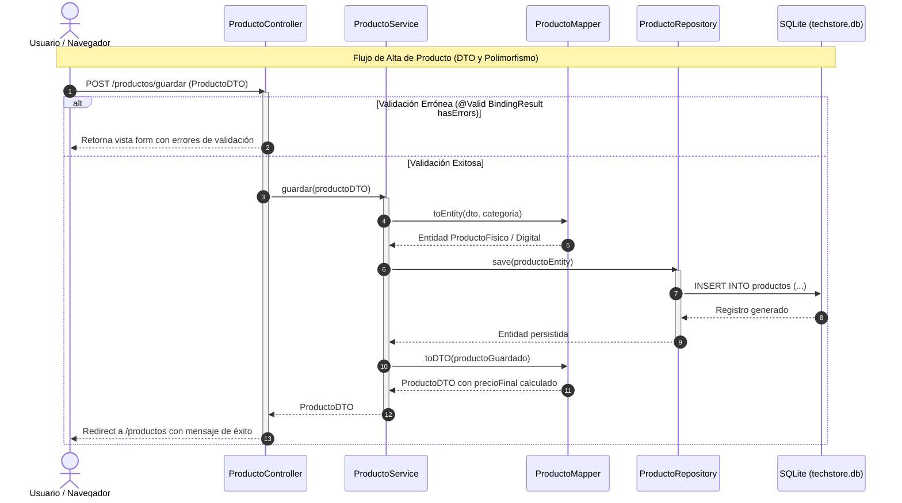

# TechStore MVC - Sistema de Gestión Tecnológica y Órdenes de Compra

Proyecto desarrollado con IA que implementa la solución completa al **Ejercicio "a"**:
Arquitectura MVC en Java con Spring Boot, vistas renderizadas del lado del servidor con **Thymeleaf**, interfaz responsiva estilizada con **Bootstrap 5 (estilo ThemeWagon)**, persistencia ORM con base de datos embebida **SQLite**, desacoplamiento estricto de capas mediante **DTOs**, autenticación de usuarios con roles y modelado exhaustivo de las relaciones UML: **Herencia, Composición, Agregación y Asociación**.

---

## 1. Problema de Negocio Resuelto

> *"Trabajamos en el desarrollo del sistema para una empresa que realiza venta de productos de tecnología, estos se actualizan en el stock de la empresa por medio de compras a sus proveedores mayorista mediante el uso de órdenes de compra que registran el detalle de la misma."*

### Requerimientos Clave Satisfechos:
1. **Actualización Automática de Stock**: Al confirmar la recepción física de una `OrdenDeCompra` en estado `PENDIENTE`, el sistema pasa su estado a `RECIBIDA` e incrementa automáticamente el `stock` en la base SQLite de todos los productos físicos (`ProductoFisico`) incluidos en sus renglones de detalle.
2. **Acceso con Usuario y Contraseña**: Protección de rutas mediante `AuthInterceptor` y formulario de login responsivo (`/login`) con credenciales y roles asignados (`ADMIN`, `COMPRAS`, `VENDEDOR`).
3. **Capa DTO Obligatoria**: La información que fluye entre Controladores (`@Controller`), Servicios (`@Service`) y Vistas (`Thymeleaf`) se transporta a través de objetos de transferencia de datos (`ProductoDTO`, `CategoriaDTO`, `ProveedorDTO`, `OrdenDeCompraDTO`, `DetalleOrdenCompraDTO`, `UsuarioDTO`, `LoginDTO`), evitando la exposición de entidades JPA y previniendo vulnerabilidades de *Mass Assignment*.
4. **Plantilla HTML/CSS Bootstrap 5 (Estilo ThemeWagon)**: Sidebar colapsable/fija con navegación modular, topbar con identificación de usuario y sesión, tarjetas métricas KPI, alertas visuales de stock crítico, tablas interactivas con badges y diseño estético profesional.
5. **Comentarios Detallados en Código**: Cada clase, atributo, anotación y método cuenta con explicaciones técnicas profundas sobre arquitectura MVC, persistencia JPA y diseño orientado a objetos.

---

## 2. Modelado de Relaciones UML Implementadas

El sistema plasma con rigor las cuatro relaciones fundamentales del diseño orientado a objetos:

```
                  ┌──────────────────────┐
                  │  <<abstract>> Usuario│ (Herencia)
                  └──────────┬───────────┘
         ┌───────────────────┼───────────────────┐
         ▼                   ▼                   ▼
┌─────────────────┐ ┌─────────────────┐ ┌────────────────────┐
│  Administrador  │ │    Vendedor     │ │  EncargadoCompras  │
└─────────────────┘ └─────────────────┘ └─────────┬──────────┘
                                                  │ 1 registra 0..* (Asociación)
                                                  ▼
┌─────────────────┐                     ┌────────────────────┐ 0..* emitida a 1 ┌────────────────┐
│    Categoria    │                     │   OrdenDeCompra    ├─────────────────►│   Proveedor    │
└────────┬────────┘                     └─────────┬──────────┘  (Asociación)    └────────────────┘
         │ 1 agrupa 0..* (Agregación)             │ 1 contiene 1..* (Composición)
         ▼                                        ▼
┌─────────────────┐ 1 referencia 0..*   ┌────────────────────┐
│<<abstract>>     │◄────────────────────┤ DetalleOrdenCompra │
│    Producto     │    (Asociación)     └────────────────────┘
└────────┬────────┘
    ┌────┴────┐ (Herencia)
    ▼         ▼
┌─────────┐ ┌──────────┐
│Producto │ │ Producto │
│ Fisico  │ │ Digital  │
└─────────┘ └──────────┘
```

| Relación UML | Entidades Involucradas | Justificación Teórica y Mapeo ORM (JPA) |
|---|---|---|
| **Herencia** | `Usuario` $\rightarrow$ `Administrador`, `Vendedor`, `EncargadoCompras` | Generalización de atributos y métodos comunes (`login`, `logout`) con especializaciones de rol. Mapeado con `@Inheritance(strategy = SINGLE_TABLE)` en SQLite. |
| **Herencia** | `Producto` $\rightarrow$ `ProductoFisico`, `ProductoDigital` | Especialización para hardware (con stock, peso, ubicación) y software (claves de licencia, URL, vigencia). Método polimórfico `calcularPrecioFinal()`. |
| **Agregación** | `Categoria` $\rightarrow$ `Producto` (`1 agrupa 0..*`) | Relación "todo-parte" débil. Un producto pertenece a una categoría, pero si la categoría se elimina, los productos persisten o pueden reasignarse (`@ManyToOne` sin eliminación en cascada). |
| **Composición** | `OrdenDeCompra` $\rightarrow$ `DetalleOrdenCompra` (`1 contiene 1..*`) | Relación "todo-parte" fuerte con dependencia existencial. Los renglones no existen sin la orden (`CascadeType.ALL`, `orphanRemoval = true`). |
| **Asociación** | `OrdenDeCompra` $\leftrightarrow$ `Proveedor` (`0..* emitida a 1`) | Vínculo estructural de negocio entre entidades independientes. |
| **Asociación** | `DetalleOrdenCompra` $\leftrightarrow$ `Producto` (`0..* referencia 1`) | Cada renglón de compra hace referencia a un producto específico del catálogo. |
| **Asociación** | `EncargadoCompras` $\leftrightarrow$ `OrdenDeCompra` (`1 registra 0..*`) | Traza qué usuario del área de compras emitió la orden. |

---

## 3. Diagrama de Secuencia del ABM de Productos

Accesible también de forma interactiva en el sistema desde la ruta `/docs/diagramas`:



---

## 4. Credenciales de Acceso al Sistema

La base de datos SQLite se inicializa automáticamente al arrancar con tres usuarios demostrativos:

| Usuario | Contraseña | Rol / Especialización UML | Funcionalidades Principales |
|---|---|---|---|
| `admin` | `admin123` | **Administrador** | Acceso total al catálogo, proveedores, órdenes y diagramas. |
| `compras` | `compras123` | **EncargadoCompras** | Emisión de órdenes de compra y confirmación de recepción para sumar stock. |
| `vendedor` | `vendedor123` | **Vendedor** | Consulta de catálogo y verificación de stock para clientes. |

---

## 5. Instrucciones de Ejecución

### Requisitos:
- Java JDK 21 o superior instalado (detectado: JDK 26).
- Maven Wrapper provisto en el directorio del proyecto (`mvnw.cmd` para Windows).

### Comandos:
```bash
# Navegar a la carpeta del proyecto
cd c:\Users\Lucho\Desktop\software-engineering\individual-5\mvc-ia

# Compilar el proyecto
.\mvnw.cmd compile

# Ejecutar las pruebas automatizadas (unitarias y de integración)
.\mvnw.cmd test

# Iniciar la aplicación Spring Boot
.\mvnw.cmd spring-boot:run
```

Una vez iniciada la aplicación, ingresar en el navegador web a:
👉 **`http://localhost:8080/login`**

