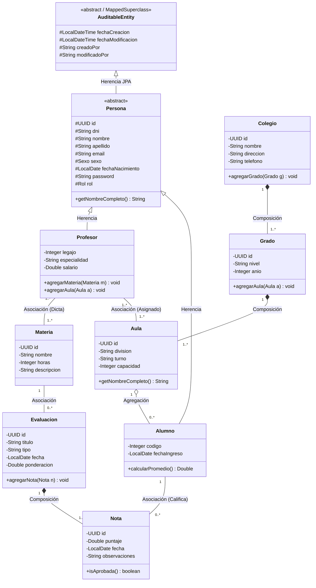
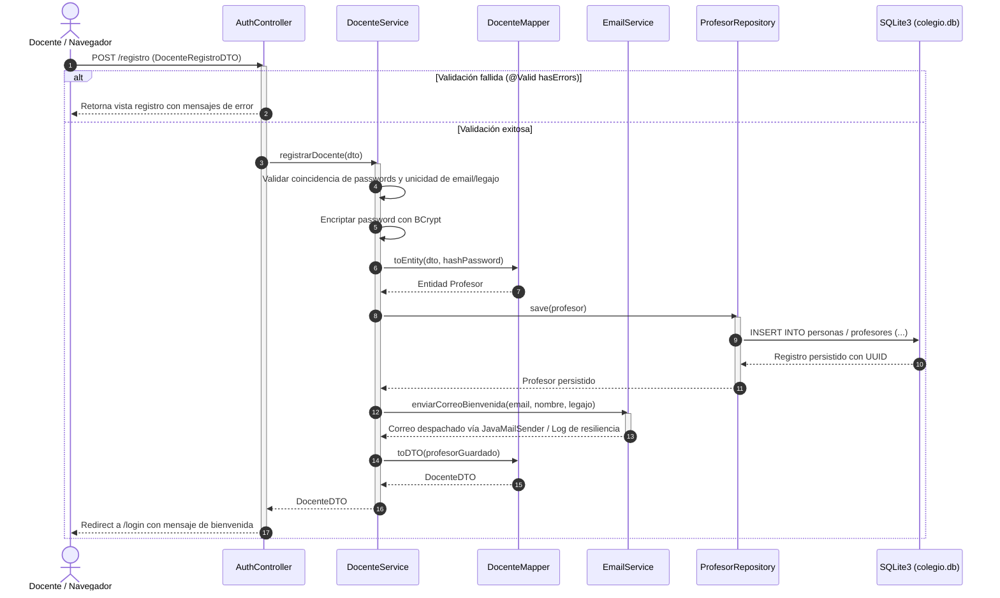

# Sistema de Gestión Escolar MVC - Inciso "a" con IA

Proyecto desarrollado con IA que implementa la solución completa al **Ejercicio "a"**:
Arquitectura **MVC** en Java con **Spring Boot**, vistas renderizadas del lado del servidor con **Thymeleaf**, interfaz responsiva estilizada con **Bootstrap 5 (estilo ThemeWagon)**, persistencia ORM con base de datos embebida **SQLite3**, desacoplamiento estricto de capas mediante **DTOs**, **Auditoría de Entidades**, **Spring Security con roles y cambio de contraseña**, servicio de **Envío de Correo de Bienvenida** y **Rediseño del Diagrama de Clases UML** cumpliendo con **Herencia, Composición, Agregación y Asociación**.

---

## 1. Problema Planteado y Requerimientos Satisfechos

> *"Trabajamos en el desarrollo de un software para colegios, donde se registran los alumnos con su respectivo grado y aula, junto a sus profesores. Además, se registran las notas por materias de los alumnos.*
> *➢ Al problema planteado en el ejercicio, proponer nuevas funcionalidades que permitan la existencia de las relaciones UML de Asociación, Agregación, Composición y Herencia."*

### Requerimientos Específicos Cumplidos:
1. **Acceso Docente por Usuario y Contraseña**:
   - Registro de profesores con campos obligatorios: **Nombre**, **Apellido**, **Sexo** y **Fecha de Nacimiento**.
   - El **usuario** de autenticación es el **correo personal del docente**.
   - Contraseña cifrada de forma segura con `BCryptPasswordEncoder`.
   - Módulo exclusivo para **cambiar la contraseña** (`/perfil/cambiar-password`) con validación de clave actual y confirmación.
2. **Envío de Correo de Bienvenida**:
   - Al registrarse un docente en el sistema, se despacha automáticamente un correo de bienvenida a su casilla personal vía `EmailService` (`JavaMailSender`).
   - Cuenta con manejo tolerante a fallos para entornos offline o de desarrollo local.
3. **Capa DTO Obligatoria**:
   - Todo intercambio entre la vista (`Thymeleaf`), los controladores (`@Controller`) y la capa de servicios (`@Service`) se realiza exclusivamente mediante **DTOs** (`DocenteRegistroDTO`, `DocenteDTO`, `AlumnoDTO`, `NotaDTO`, `MateriaDTO`, `EvaluacionDTO`, `CambioPasswordDTO`, `AulaDTO`, `GradoDTO`), previniendo vulnerabilidades de asignación masiva (*mass assignment*).
4. **Auditoría de Entidades**:
   - Implementada con Spring Data JPA Auditing (`@EnableJpaAuditing` y `AuditorAware`).
   - La clase `@MappedSuperclass` `AuditableEntity` registra de forma transparente: `fechaCreacion`, `fechaModificacion`, `creadoPor` y `modificadoPor`.
5. **Persistencia ORM con SQLite3**:
   - Motor relacional embebido sin dependencias externas complejas (`colegio.db`).
   - Mapeo ORM con Hibernate mediante `hibernate-community-dialects`.
6. **Plantilla HTML/CSS con Bootstrap 5 (Estilo ThemeWagon)**:
   - Diseño moderno tipo dashboard administrativo con navegación lateral modular (`sidebar`), barra superior (`top-navbar`), tarjetas métricas KPI, badges contextuales y tablas interactivas.
   - Fragmentos Thymeleaf reutilizables (`alerts`, `sidebar`, `navbar`, `main-layout`).
7. **Documentación Exhaustiva y Comentarios**:
   - El código fuente posee comentarios técnicos de gran profundidad en cada capa, anotación y método.

---

## 2. Rediseño del Diagrama de Clases UML (Inciso a)

El diagrama original provisto ha sido enriquecido para formalizar y garantizar la presencia de las cuatro relaciones fundamentales del paradigma orientado a objetos:



---

## 3. Justificación Teórica y Mapeo ORM de las Relaciones UML

| Relación UML | Entidades | Cardinalidad | Justificación de Negocio y Mapeo Técnico (JPA / Hibernate) |
|---|---|---|---|
| **Herencia** | `Persona` $\rightarrow$ `Profesor`, `Alumno` | 1 a 1 | Generalización de atributos compartidos (`dni`, `nombre`, `apellido`, `email`, `sexo`, `fechaNacimiento`, `password`, `rol`). Mapeado con estrategia `@Inheritance(strategy = InheritanceType.JOINED)`. |
| **Composición** | `Colegio` $\rightarrow$ `Grado` $\rightarrow$ `Aula` | 1 a 1..* | Relación "todo-parte" fuerte con dependencia existencial. Un aula o grado no puede subsistir fuera del colegio. Mapeado con `CascadeType.ALL` y `orphanRemoval = true`. |
| **Composición** | `Evaluacion` $\rightarrow$ `Nota` | 1 a 1..* | Una calificación no existe independientemente del examen o trabajo evaluativo que califica. Si se elimina la evaluación, sus notas se destruyen en cascada (`orphanRemoval = true`). |
| **Agregación** | `Aula` $\rightarrow$ `Alumno` | 1 a 0..* | Relación "todo-parte" débil. Un aula agrupa a los estudiantes de una división. Si el aula se disuelve o cierra, los alumnos **no se destruyen** (mantienen su estado en el colegio). No lleva eliminación en cascada. |
| **Asociación** | `Profesor` $\leftrightarrow$ `Materia` | 1..* a 1..* | Vínculo estructural de cátedra: los profesores dictan materias. Mapeado mediante tabla intermedia `@ManyToMany` (`profesor_materia`). |
| **Asociación** | `Profesor` $\leftrightarrow$ `Aula` | 1..* a 1..* | Asignación docente por comisiones de clase (`profesor_aula`). |
| **Asociación** | `Alumno` $\leftrightarrow$ `Nota` | 1 a 0..* | Cada nota individualiza el puntaje obtenido por un estudiante específico en una evaluación. |

---

## 4. Diagrama de Secuencia del Registro y Envío de Correo



---

## 5. Estructura Arquitectónica del Proyecto

```
mvc-ia/
├── pom.xml
├── README.md
├── colegio.db (se genera automáticamente al iniciar)
└── src/
    ├── main/
    │   ├── java/com/colegio/
    │   │   ├── ColegioApplication.java
    │   │   ├── config/
    │   │   │   ├── SecurityConfig.java
    │   │   │   └── JpaAuditingConfig.java
    │   │   ├── controller/
    │   │   │   ├── AuthController.java
    │   │   │   ├── DashboardController.java
    │   │   │   ├── DocenteController.java
    │   │   │   ├── AlumnoController.java
    │   │   │   ├── MateriaController.java
    │   │   │   ├── NotaController.java
    │   │   │   ├── PerfilController.java
    │   │   │   └── DiagramaController.java
    │   │   ├── dto/
    │   │   │   ├── DocenteRegistroDTO.java
    │   │   │   ├── DocenteDTO.java
    │   │   │   ├── CambioPasswordDTO.java
    │   │   │   ├── AlumnoDTO.java
    │   │   │   ├── MateriaDTO.java
    │   │   │   ├── EvaluacionDTO.java
    │   │   │   ├── NotaDTO.java
    │   │   │   ├── AulaDTO.java
    │   │   │   └── GradoDTO.java
    │   │   ├── mapper/
    │   │   │   ├── DocenteMapper.java
    │   │   │   ├── AlumnoMapper.java
    │   │   │   ├── MateriaMapper.java
    │   │   │   ├── EvaluacionMapper.java
    │   │   │   ├── NotaMapper.java
    │   │   │   ├── AulaMapper.java
    │   │   │   └── GradoMapper.java
    │   │   ├── model/
    │   │   │   ├── AuditableEntity.java
    │   │   │   ├── Persona.java
    │   │   │   ├── Profesor.java
    │   │   │   ├── Alumno.java
    │   │   │   ├── Colegio.java
    │   │   │   ├── Grado.java
    │   │   │   ├── Aula.java
    │   │   │   ├── Materia.java
    │   │   │   ├── Evaluacion.java
    │   │   │   ├── Nota.java
    │   │   │   ├── Sexo.java
    │   │   │   └── Rol.java
    │   │   ├── repository/
    │   │   │   ├── PersonaRepository.java
    │   │   │   ├── ProfesorRepository.java
    │   │   │   ├── AlumnoRepository.java
    │   │   │   ├── ColegioRepository.java
    │   │   │   ├── GradoRepository.java
    │   │   │   ├── AulaRepository.java
    │   │   │   ├── MateriaRepository.java
    │   │   │   ├── EvaluacionRepository.java
    │   │   │   └── NotaRepository.java
    │   │   └── service/
    │   │       ├── DocenteService.java
    │   │       ├── AlumnoService.java
    │   │       ├── MateriaService.java
    │   │       ├── EvaluacionService.java
    │   │       ├── NotaService.java
    │   │       ├── AulaService.java
    │   │       ├── EmailService.java
    │   │       ├── CustomUserDetailsService.java
    │   │       └── DataInitializationService.java
    │   └── resources/
    │       ├── application.properties
    │       ├── static/css/custom.css
    │       └── templates/
    │           ├── layout/main-layout.html
    │           ├── fragments/sidebar.html
    │           ├── fragments/navbar.html
    │           ├── fragments/alerts.html
    │           ├── auth/login.html
    │           ├── auth/registro.html
    │           ├── dashboard/index.html
    │           ├── docentes/index.html
    │           ├── alumnos/index.html
    │           ├── alumnos/form.html
    │           ├── materias/index.html
    │           ├── materias/form.html
    │           ├── notas/index.html
    │           ├── notas/form.html
    │           ├── notas/evaluacion-form.html
    │           ├── perfil/cambiar-password.html
    │           └── docs/diagrama.html
    └── test/
        └── java/com/colegio/ColegioApplicationTests.java
```

---

## 6. Instrucciones para Compilar y Ejecutar

### Requisitos Previos:
- JDK 21 o superior instalado.
- Maven (o utilizar el comando Maven disponible en el entorno).

### Ejecución:
En una terminal situada en la carpeta `mvc-ia`:
```bash
mvn spring-boot:run
```

O empaquetar y ejecutar el JAR:
```bash
mvn clean package -DskipTests
java -jar target/colegio-mvc-1.0.0.jar
```

### Credenciales Docente de Demostración:
Al iniciar por primera vez, `DataInitializationService` genera automáticamente un conjunto de datos iniciales en `colegio.db`:
- **Usuario / Correo:** `profesor.demo@colegio.edu.ar`
- **Contraseña:** `password123`

O bien registrar un nuevo docente desde `/registro` completando todos los datos requeridos.
El sistema estará disponible en: [http://localhost:8080](http://localhost:8080).

