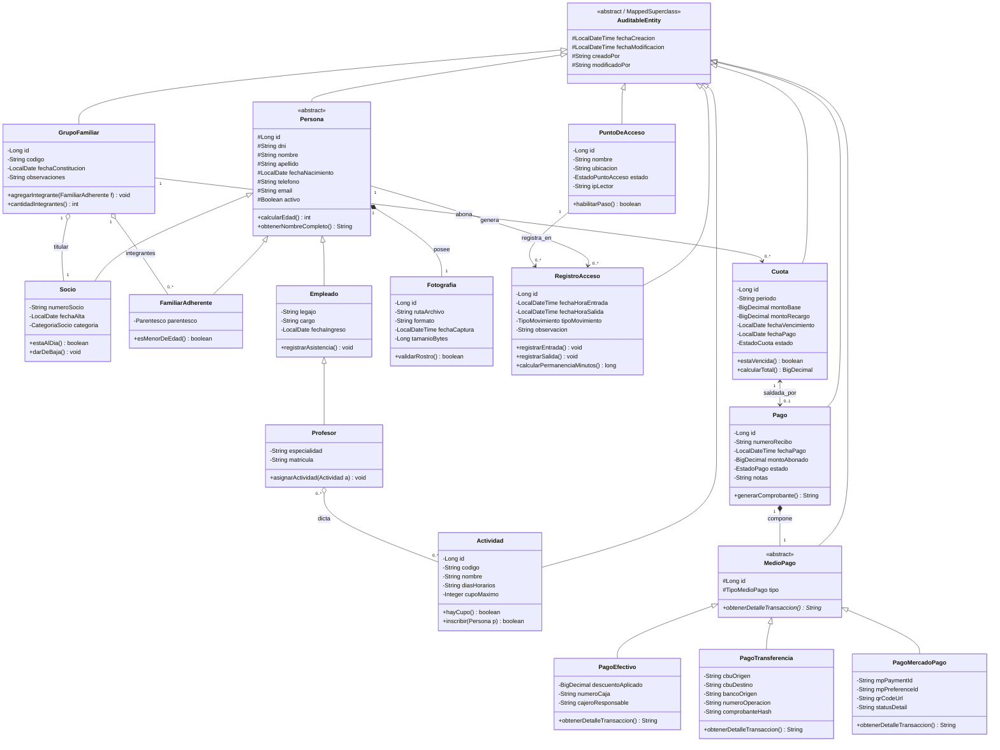

# Sistema de Gestión para Club Deportivo MVC con IA - Ejercicio "a"

Proyecto desarrollado integralmente con IA que implementa la solución completa al **Ejercicio "a"**:
Arquitectura **MVC** en Java con **Spring Boot**, vistas renderizadas del lado del servidor con **Thymeleaf**, interfaz responsiva de última generación estilizada con **Bootstrap 5 (estilo ThemeWagon Admin Dashboard)**, persistencia ORM con base de datos **MySQL** (y perfil fallback H2 en modo MySQL), desacoplamiento estricto de capas mediante **DTOs**, **Auditoría de Entidades**, **Spring Security con roles RBAC y BCrypt**, módulo de **Pagos Multicanal (Efectivo, Transferencia, Mercado Pago)**, registro biométrico facial y **Rediseño del Diagrama de Clases UML** formalizando **Herencia, Composición, Agregación y Asociación**.

---

## 1. Problema Planteado y Requerimientos Satisfechos

> *"Trabajamos en un sistema para un club deportivo donde se registra el socio y su grupo familiar. Al ingresar al club el sistema registra el horario de entrada, lo mismo sucede en caso de salida. El sistema guarda además de los datos principales una imagen con el rostro de cada persona.*  
> *➢ Al problema planteado en el ejercicio, proponer nuevas funcionalidades que permitan la existencia de las relaciones UML de Asociación, Agregación, Composición y Herencia.*  
> *➢ Rediseñar el Diagrama de clases y agregar la funcionalidad para poder registrar el pago de la cuota del club para cada familia, donde el pago se puede realizar con distintos medios de pago (Efectivo, Transferencia, Mercado Pago).*  
> *➢ También diseñar las pruebas Unitarias, de Carga y Stress para realizar el Testing del software desarrollado.*  
> *➢ Utilizar una plantilla HTML/CSS con Bootstrap (ej: ThemeWagon) y describir funcionalidades, capas y anotaciones con el mayor detalle posible."*

---

## 2. Rediseño del Diagrama de Clases UML

El diagrama original provisto ha sido reestructurado y enriquecido para modelar con rigor técnico las **cuatro relaciones fundamentales de POO** e incorporar el subsistema de **Cuotas Familiares y Medios de Pago**:



### Justificación de las 4 Relaciones UML Implementadas:

1. **Herencia (Generalización / Especialización):**
   - Jerarquía de Individuos: `Persona` es la entidad abstracta padre mapeada con `@Inheritance(strategy = InheritanceType.JOINED)`. De ella derivan `Socio`, `FamiliarAdherente` y `Empleado`. A su vez, `Profesor` hereda de `Empleado` (herencia multinivel).
   - Jerarquía de Medios de Pago: `MedioPago` es la clase abstracta padre con método polimórfico `obtenerDetalleTransaccion()`. De ella derivan `PagoEfectivo`, `PagoTransferencia` y `PagoMercadoPago`.
2. **Composición (Diamante Negro):**
   - `Persona` *1* $\blacklozenge$--- *1* `Fotografia`: La captura biométrica del rostro no tiene vida propia fuera de la persona asociada; al eliminarse una persona de la base de datos, su registro fotográfico se elimina en cascada (`CascadeType.ALL, orphanRemoval = true`).
   - `Pago` *1* $\blacklozenge$--- *1* `MedioPago`: La transacción de cobro contiene intrínsecamente su medio de abono; no existe un medio de pago huérfano sin su recibo de pago.
3. **Agregación (Diamante Blanco):**
   - `GrupoFamiliar` *1* $\lozenge$--- `Socio` titular y `FamiliarAdherente` miembros: Si el grupo familiar se disuelve o reestructura, el socio y sus familiares continúan existiendo de manera independiente como personas en el sistema.
   - `Profesor` $\lozenge$--- `Actividad`: Una actividad puede contar con múltiples profesores asignados y viceversa; ambos existen independientemente.
4. **Asociación (Línea simple con navegabilidad):**
   - `RegistroAcceso` con `Persona` y con `PuntoDeAcceso` (molinetes).
   - `Cuota` con `GrupoFamiliar` y con `Pago`.

---

## 3. Módulo de Pagos Multicanal para Cuotas Familiares

El sistema incorpora un módulo interactivo de cobro para cancelar las cuotas del club para cada familia:
1. **Efectivo en Caja / Ventanilla (`PagoEfectivo`):**
   - Permite aplicar descuentos comerciales por pago contado o pronto pago.
   - Registra número de caja (`CAJA-01`) y operador cajero responsable.
2. **Transferencia Bancaria (`PagoTransferencia`):**
   - Conciliación electrónica mediante CBU/CVU de origen, entidad bancaria emisora, número de operación oficial y hash de comprobante.
   - Muestra de forma transparente el CBU y Alias institucional del club.
3. **Mercado Pago (`PagoMercadoPago`):**
   - Integración con pasarela Fintech: generación de `mp_payment_id`, link de preferencia checkout y código QR para cobro desde smartphone.
4. **Automatización y Emisión de Recibos:**
   - Al confirmarse el pago, la `Cuota` cambia atómicamente su estado a `PAGADA`.
   - Se restituye de forma inmediata el estado `AL DÍA` de la familia, autorizando el paso por los molinetes.
   - Se emite el **Recibo Oficial de Pago** con formato imprimible (`@media print`) y sello institucional.

---

## 4. Arquitectura de Software y Capas MVC

El código fuente está estructurado bajo principios de arquitectura limpia y desacoplamiento estricto mediante **DTOs**:

```
src/main/java/com/clubdeportivo
├── config/                 # Seguridad, Auditoría JPA y WebMvc
│   ├── JpaAuditingConfig.java
│   ├── SecurityConfig.java
│   └── WebMvcConfig.java
├── controller/             # Controladores Spring MVC (Vistas Thymeleaf)
│   ├── AuthController.java
│   ├── ControlAccesoController.java
│   ├── CuotaController.java
│   ├── DashboardController.java
│   ├── GrupoFamiliarController.java
│   ├── PagoController.java
│   └── SocioController.java
├── dto/                    # Objetos de Transferencia de Datos
│   ├── request/            # Contratos de entrada con validación JSR 380 (@NotNull, @Valid)
│   └── response/           # Proyecciones seguras para presentación en vistas
├── entity/                 # Entidades JPA / Hibernate con herencia y auditoría
│   ├── AuditableEntity.java
│   ├── Persona.java, Socio.java, FamiliarAdherente.java, Empleado.java, Profesor.java
│   ├── Fotografia.java, GrupoFamiliar.java, Actividad.java, PuntoDeAcceso.java
│   ├── RegistroAcceso.java, Cuota.java, Pago.java
│   ├── MedioPago.java, PagoEfectivo.java, PagoTransferencia.java, PagoMercadoPago.java
│   ├── Usuario.java
│   └── enums/              # CategoriaSocio, EstadoCuota, EstadoPago, TipoMedioPago, etc.
├── mapper/                 # Mappers bidireccionales seguros entre Entidades y DTOs
├── repository/             # Repositorios Spring Data JPA con consultas derivadas y @Query
├── service/                # Interfaces y Lógica de Negocio Transaccional (@Transactional)
│   └── impl/
└── init/                   # DataInitializer con precarga inicial de prueba
```

---

## 5. Diseño y Resultados de Testing

El proyecto cuenta con una batería completa de pruebas:

### 5.1 Pruebas Unitarias y de Integración (JUnit 5 + Mockito)
- **PersonaDomainTest:** Validación de cálculo de edad cronológica, formato de nombre completo y validación de fotografía biométrica.
- **SocioDomainTest:** Reglas de negocio para condición `estaAlDia()` y bajas lógicas.
- **CuotaDomainTest:** Verificación de vencimientos y aplicación automática de recargos por mora.
- **PagoServiceImplTest (Mockito):** Pruebas unitarias de procesamiento de pagos con Efectivo, Transferencia y Mercado Pago, e idempotencia contra cuotas ya canceladas.
- **ControlAccesoServiceImplTest (Mockito):** Autorización de paso en molinete para socios al día y bloqueo por morosidad o mantenimiento de hardware.
- **ClubDeportivoIntegrationTest (Spring Boot + MockMvc):** Verificación integral del ciclo HTTP, filtros de Spring Security y renderizado de controladores.

**Resultado de la Suite de Pruebas:**
```
[INFO] Tests run: 22, Failures: 0, Errors: 0, Skipped: 0
[INFO] BUILD SUCCESS
```

### 5.2 Pruebas de Carga y Stress (Apache JMeter & Python Runner)
- **Plan JMeter:** Ubicado en `testing/jmeter_club_load_stress_plan.jmx`.
- **Ejecutor Concurrente en Python:** Ubicado en `testing/stress_test_runner.py`. Simula 200 peticiones concurrentes con 20 hilos de ejecución midiendo latencias p50, p90, p95 y p99.
- **Documento Metodológico:** Ubicado en `docs/PLAN_DE_PRUEBAS_CARGA_STRESS.md`.

---

## 6. Instrucciones de Ejecución

### Requisitos Previos:
- Java JDK 17, 21 o 26.
- Maven Wrapper incluido (`mvnw.cmd` / `mvnw`).

### 1. Compilación y Ejecución de Pruebas:
```powershell
.\mvnw.cmd test
```

### 2. Puesta en Marcha de la Aplicación:
```powershell
.\mvnw.cmd spring-boot:run
```
La aplicación iniciará en `http://localhost:8080`.

### 3. Credenciales de Acceso Precargadas:
| Perfil / Rol | Usuario | Contraseña | Permisos y Alcance |
|---|---|---|---|
| **Administrador General** | `admin` | `admin123` | Control total, emisión de cuotas, finanzas y auditoría |
| **Operador de Molinetes** | `operador` | `operador123` | Consola en vivo de molinetes y cobro de cuotas |
| **Socio Titular** | `socio` | `socio123` | Portal de consulta de grupo familiar y recibos |

### 4. Base de Datos MySQL:
Para conectar a un servidor MySQL físico o contenedor Docker:
1. Ejecutar el script DDL `src/main/resources/schema-mysql.sql`.
2. Iniciar con el perfil activo MySQL:
```powershell
.\mvnw.cmd spring-boot:run -Dspring-boot.run.profiles=mysql
```
Por defecto, la aplicación utiliza H2 en modo MySQL con esquema automático y datos de prueba.

